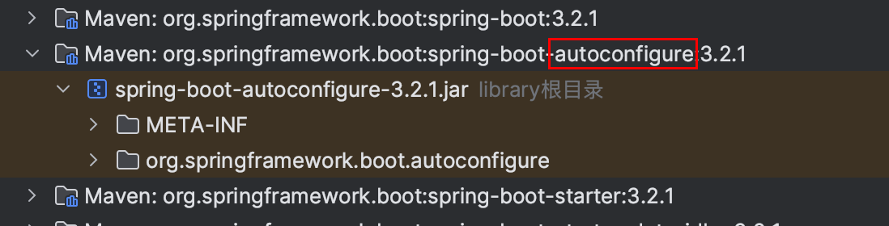
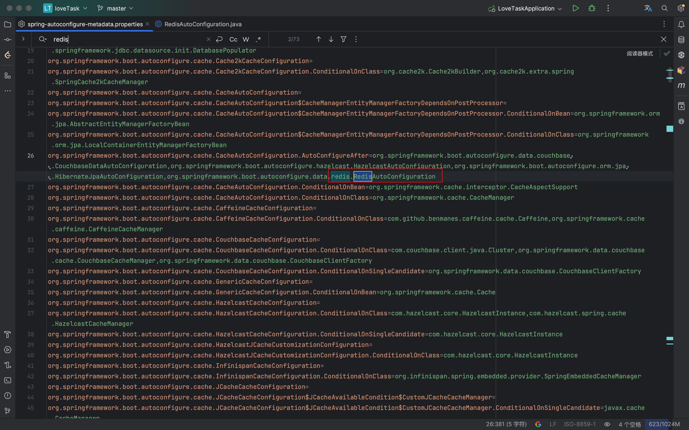
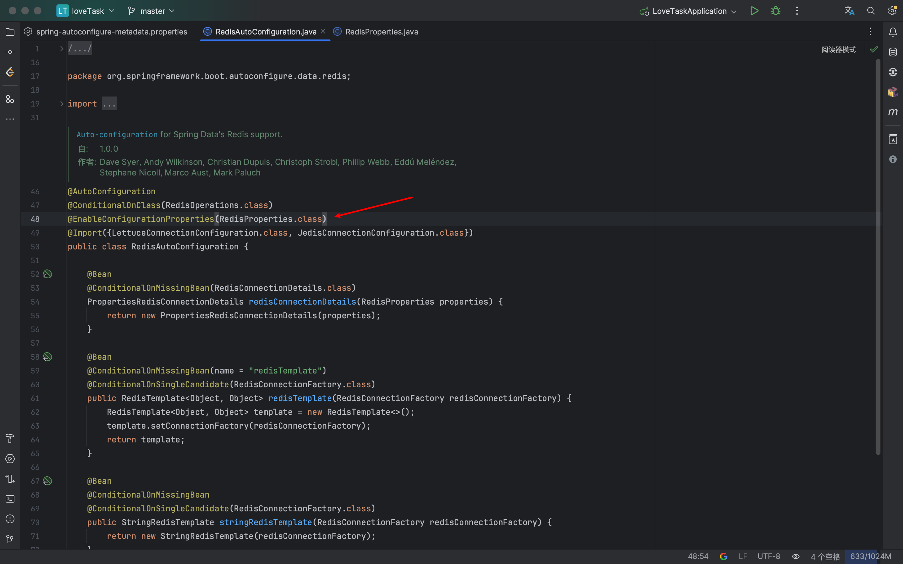
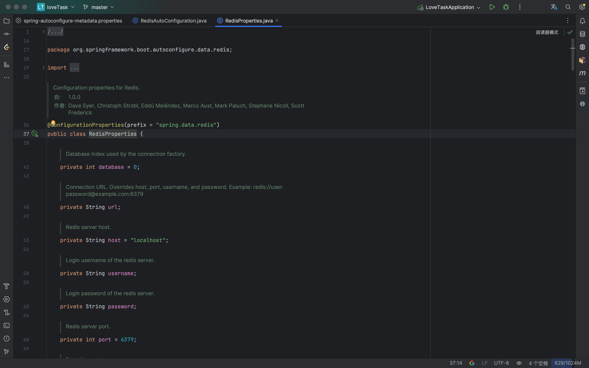

# 查看配置的方法

1.   首先找到autoconfigure结尾的包

2.   然后打开`META_INF/spring-autoconfigure-metadata.properties`文件，查找对应的自动配置类。
3.   配置类中包含配置的导入然后就可以看到配置的信息。

# 自动配置原理

Spring及SpringBoot里按条件创建Bean的核心是`@Condition`接口与`@Conditional`注解,其实在SpringBoot里还有一种AutoConfigure也可以来过滤配置，只不过使用这种技术，能够让SpringBoot更快速的启动。

SpringBoot使用一个Annotation的处理器来收集一些自动装配的条件，那么这些条件可以在`META-INF/spring-autoconfigure-metadata.properties`进行配置。

# spring.factories和spring-autoconfigure-metadata.properties区别

>   AI 内容有待校验

共同点：

1.   都位于`META-INF`目录下
2.   都是以key=value的形式配置
3.   都用于实现Spring Boot自动配置

不同点：

1.   内容和作用：
     *   **`spring.factories`：** 包含了自动配置类的类名，告诉 Spring Boot 在启动时应该自动配置哪些类。每个配置项的值是实际的自动配置类。
     *   **`spring-autoconfigure-metadata.properties`：** 包含了自动配置类的元数据信息，用于定义**条件和规则**，以确定是否应该启用特定的自动配置类。
2.   文件结构：
     *   **`spring.factories`：** 是一个键值对的配置文件，键是接口或类，值是实际的自动配置类。它没有详细的条件信息。
     *   **`spring-autoconfigure-metadata.properties`：** 包含了更详细的**元数据信息**，例如**条件判断**的细节。它通常包含了多行的配置，每一行都对应一个自动配置类，定义了启用该自动配置的条件。配置格式：`自动配置的类全名.条件=值`

3.   加载时机：

     *   **`spring.factories`：** 在应用程序启动时由 Spring Boot 加载，用于确定需要自动配置哪些类。

     *   **`spring-autoconfigure-metadata.properties`：** 也在应用程序启动时加载，但主要用于提供更详细的条件信息，帮助 Spring Boot 决定是否要应用某个自动配置类。

4.   可扩展性：
     *   **`spring.factories`：** 开发者可以通过修改或扩展该文件来自定义自动配置。
     *   **`spring-autoconfigure-metadata.properties`：** 通常由 Spring Boot 自动生成，开发者较少直接操作该文件。