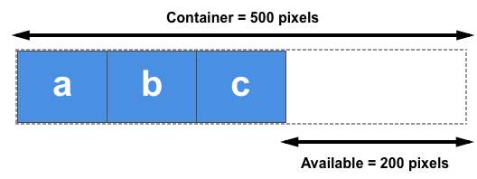

# flex 布局的基本概念

Flexible Box 模型，通常被称为 flexbox，是一种一维的布局模型。它给 flexbox 的子元素之间提供了强大的空间分布和对齐能力。本文给出了 flexbox 的主要特性，更多的细节将在别的文档中探索。

我们说 flexbox 是一种一维的布局，是因为一个 flexbox 一次只能处理一个维度上的元素布局，一行或者一列。作为对比的是另外一个二维布局 [CSS Grid Layout](https://developer.mozilla.org/zh-CN/docs/Web/CSS/CSS_grid_layout)，可以同时处理行和列上的布局。

## [flexbox 的两根轴线](https://developer.mozilla.org/zh-CN/docs/Web/CSS/CSS_flexible_box_layout/Basic_concepts_of_flexbox#flexbox_的两根轴线)

当使用 flex 布局时，首先想到的是两根轴线 — 主轴和交叉轴。主轴由 [`flex-direction`](https://developer.mozilla.org/zh-CN/docs/Web/CSS/flex-direction) 定义，另一根轴垂直于它。我们使用 flexbox 的所有属性都跟这两根轴线有关，所以有必要在一开始首先理解它。

### [主轴](https://developer.mozilla.org/zh-CN/docs/Web/CSS/CSS_flexible_box_layout/Basic_concepts_of_flexbox#主轴)

主轴由 `flex-direction` 定义，可以取 4 个值：

* `row`
* `row-reverse`
* `column`
* `column-reverse`

如果你选择了 `row` 或者 `row-reverse`，你的主轴将沿着 **inline** 方向延伸。

选择 `column` 或者 `column-reverse` 时，你的主轴会沿着上下方向延伸 — 也就是 **block 排列的方向。**

### [交叉轴](https://developer.mozilla.org/zh-CN/docs/Web/CSS/CSS_flexible_box_layout/Basic_concepts_of_flexbox#交叉轴)

交叉轴垂直于主轴，所以如果你的`flex-direction` (主轴) 设成了 `row` 或者 `row-reverse` 的话，交叉轴的方向就是沿着列向下的。

如果主轴方向设成了 `column` 或者 `column-reverse`，交叉轴就是水平方向。

理解主轴和交叉轴的概念对于对齐 flexbox 里面的元素是很重要的；flexbox 的特性是沿着主轴或者交叉轴对齐之中的元素。

## [起始线和终止线](https://developer.mozilla.org/zh-CN/docs/Web/CSS/CSS_flexible_box_layout/Basic_concepts_of_flexbox#起始线和终止线)

另外一个需要理解的重点是 flexbox 不会对文档的书写模式提供假设。过去，CSS 的书写模式主要被认为是水平的，从左到右的。现代的布局方式涵盖了书写模式的范围，所以我们不再假设一行文字是从文档的左上角开始向右书写，新的行也不是必须出现在另一行的下面。

你可以在接下来的文章中学到更多 flexbox 和书写模式关系的详细说明。下面的描述是来帮助我们理解为什么不用上下左右来描述 flexbox 元素的方向。

如果 `flex-direction` 是 `row` ，并且我是在书写英文，那么主轴的起始线是左边，终止线是右边。

在这两种情况下，交叉轴的起始线是 flex 容器的顶部，终止线是底部，因为两种语言都是水平书写模式。

之后，你会觉得用起始和终止来描述比左右更合适，这会对你理解其他相同模式的布局方法（例如：CSS Grid Layout）起到帮助的作用。

## [Flex 容器](https://developer.mozilla.org/zh-CN/docs/Web/CSS/CSS_flexible_box_layout/Basic_concepts_of_flexbox#flex_容器)

文档中采用了 flexbox 的区域就叫做 flex 容器。为了创建 flex 容器，我们把一个容器的 [`display`](https://developer.mozilla.org/zh-CN/docs/Web/CSS/display) 属性值改为 `flex` 或者 `inline-flex`。完成这一步之后，容器中的直系子元素就会变为 **flex 元素**。所有 CSS 属性都会有一个初始值，所以 flex 容器中的所有 flex 元素都会有下列行为：

* 元素排列为一行 (`flex-direction` 属性的初始值是 `row`)。
* 元素从主轴的起始线开始。
* 元素不会在主维度方向拉伸，但是可以缩小。
* 元素被拉伸来填充交叉轴大小。
* [`flex-basis`](https://developer.mozilla.org/zh-CN/docs/Web/CSS/flex-basis) 属性为 `auto`。
* [`flex-wrap`](https://developer.mozilla.org/zh-CN/docs/Web/CSS/flex-wrap) 属性为 `nowrap`。

这会让你的元素呈线形排列，并且把自己的大小作为主轴上的大小。如果有太多元素超出容器，它们会溢出而不会换行。如果一些元素比其他元素高，那么元素会沿交叉轴被拉伸来填满它的大小。

<iframe width="100%" height="480" src="https://mdn.github.io/css-examples/flexbox/basics/the-flex-container.html" loading="lazy" style="box-sizing: content-box; border: 1px solid var(--border-primary); max-width: 100%; width: calc((100% - 2rem) - 2px); background: rgb(255, 255, 255); border-radius: var(--elem-radius); padding: 1rem; color: rgb(255, 255, 255); font-family: Inter, BlinkMacSystemFont, &quot;Segoe UI&quot;, Roboto, Oxygen, Ubuntu, Cantarell, &quot;Fira Sans&quot;, &quot;Droid Sans&quot;, &quot;Helvetica Neue&quot;, sans-serif; font-size: 16px; font-style: normal; font-variant-ligatures: normal; font-variant-caps: normal; font-weight: 400; letter-spacing: normal; orphans: 2; text-align: start; text-indent: 0px; text-transform: none; widows: 2; word-spacing: 0px; -webkit-text-stroke-width: 0px; white-space: normal; text-decoration-thickness: initial; text-decoration-style: initial; text-decoration-color: initial;"></iframe>

### [更改 flex 方向 flex-direction](https://developer.mozilla.org/zh-CN/docs/Web/CSS/CSS_flexible_box_layout/Basic_concepts_of_flexbox#更改_flex_方向_flex-direction)

在 flex 容器中添加 [`flex-direction`](https://developer.mozilla.org/zh-CN/docs/Web/CSS/flex-direction) 属性可以让我们更改 flex 元素的排列方向。设置 `flex-direction: row-reverse` 可以让元素沿着行的方向显示，但是起始线和终止线位置会交换。

把 flex 容器的属性 `flex-direction` 改为 `column` ，主轴和交叉轴交换，元素沿着列的方向排列显示。改为 `column-reverse` ，起始线和终止线交换。

下面的例子中，`flex-direction` 值为 `row-reverse`。尝试使用其他的值 `row` ，`column`，`column-reverse`，看看内容会发生什么改变。

<iframe width="100%" height="350" src="https://mdn.github.io/css-examples/flexbox/basics/flex-direction.html" loading="lazy" style="box-sizing: content-box; border: 1px solid var(--border-primary); max-width: 100%; width: calc((100% - 2rem) - 2px); background: rgb(255, 255, 255); border-radius: var(--elem-radius); padding: 1rem; color: rgb(255, 255, 255); font-family: Inter, BlinkMacSystemFont, &quot;Segoe UI&quot;, Roboto, Oxygen, Ubuntu, Cantarell, &quot;Fira Sans&quot;, &quot;Droid Sans&quot;, &quot;Helvetica Neue&quot;, sans-serif; font-size: 16px; font-style: normal; font-variant-ligatures: normal; font-variant-caps: normal; font-weight: 400; letter-spacing: normal; orphans: 2; text-align: start; text-indent: 0px; text-transform: none; widows: 2; word-spacing: 0px; -webkit-text-stroke-width: 0px; white-space: normal; text-decoration-thickness: initial; text-decoration-style: initial; text-decoration-color: initial;"></iframe>

## [用 flex-wrap 实现多行 Flex 容器](https://developer.mozilla.org/zh-CN/docs/Web/CSS/CSS_flexible_box_layout/Basic_concepts_of_flexbox#用_flex-wrap_实现多行_flex_容器)

虽然`flexbox`是一维模型，但可以使我们的`flex`项目应用到多行中。在这样做的时候，您应该把每一行看作一个新的`flex`容器。任何空间分布都将在该行上发生，而不影响该空间分布的其他行。

为了实现多行效果，请为属性[`flex-wrap`](https://developer.mozilla.org/zh-CN/docs/Web/CSS/flex-wrap)添加一个属性值`wrap`。现在，如果您的项目太大而无法全部显示在一行中，则会换行显示。下面的实时例子包含已给出宽度的项目，对于`flex`容器，项目的子元素总宽度大于容器最大宽度。由于`flex-wrap`的值设置为`wrap`，所以项目的子元素换行显示。若将其设置为`nowrap`，这也是初始值，它们将会缩小以适应容器，因为它们使用的是允许缩小的初始`Flexbox`值。如果项目的子元素无法缩小，使用`nowrap`会导致溢出，或者缩小程度还不够小。

<iframe width="100%" height="400" src="https://mdn.github.io/css-examples/flexbox/basics/flex-wrap.html" loading="lazy" style="box-sizing: content-box; border: 1px solid var(--border-primary); max-width: 100%; width: calc((100% - 2rem) - 2px); background: rgb(255, 255, 255); border-radius: var(--elem-radius); padding: 1rem; color: rgb(255, 255, 255); font-family: Inter, BlinkMacSystemFont, &quot;Segoe UI&quot;, Roboto, Oxygen, Ubuntu, Cantarell, &quot;Fira Sans&quot;, &quot;Droid Sans&quot;, &quot;Helvetica Neue&quot;, sans-serif; font-size: 16px; font-style: normal; font-variant-ligatures: normal; font-variant-caps: normal; font-weight: 400; letter-spacing: normal; orphans: 2; text-align: start; text-indent: 0px; text-transform: none; widows: 2; word-spacing: 0px; -webkit-text-stroke-width: 0px; white-space: normal; text-decoration-thickness: initial; text-decoration-style: initial; text-decoration-color: initial;"></iframe>

## [简写属性 flex-flow](https://developer.mozilla.org/zh-CN/docs/Web/CSS/CSS_flexible_box_layout/Basic_concepts_of_flexbox#简写属性_flex-flow)

你可以将两个属性 `flex-direction` 和 `flex-wrap` 组合为简写属性 [`flex-flow`](https://developer.mozilla.org/zh-CN/docs/Web/CSS/flex-flow)。第一个指定的值为 `flex-direction` ，第二个指定的值为 `flex-wrap`.

在下面的例子中，尝试将第一个值修改为 `flex-direction` 的允许取值之一，即 `row`, `row-reverse`, `column` 或 `column-reverse`, 并尝试将第二个指定值修改为 `wrap` 或 `nowrap`。

<iframe width="100%" height="400" src="https://mdn.github.io/css-examples/flexbox/basics/flex-flow.html" loading="lazy" style="box-sizing: content-box; border: 1px solid var(--border-primary); max-width: 100%; width: calc((100% - 2rem) - 2px); background: rgb(255, 255, 255); border-radius: var(--elem-radius); padding: 1rem; color: rgb(255, 255, 255); font-family: Inter, BlinkMacSystemFont, &quot;Segoe UI&quot;, Roboto, Oxygen, Ubuntu, Cantarell, &quot;Fira Sans&quot;, &quot;Droid Sans&quot;, &quot;Helvetica Neue&quot;, sans-serif; font-size: 16px; font-style: normal; font-variant-ligatures: normal; font-variant-caps: normal; font-weight: 400; letter-spacing: normal; orphans: 2; text-align: start; text-indent: 0px; text-transform: none; widows: 2; word-spacing: 0px; -webkit-text-stroke-width: 0px; white-space: normal; text-decoration-thickness: initial; text-decoration-style: initial; text-decoration-color: initial;"></iframe>

## [flex 元素上的属性](https://developer.mozilla.org/zh-CN/docs/Web/CSS/CSS_flexible_box_layout/Basic_concepts_of_flexbox#flex_元素上的属性)

为了更好地控制 flex 元素，有三个属性可以作用于它们：

* [`flex-grow`](https://developer.mozilla.org/zh-CN/docs/Web/CSS/flex-grow)
* [`flex-shrink`](https://developer.mozilla.org/zh-CN/docs/Web/CSS/flex-shrink)
* [`flex-basis`](https://developer.mozilla.org/zh-CN/docs/Web/CSS/flex-basis)

本章只会大概介绍一下它们的用法，更详细的细节请参阅其他的文章。

在考虑这几个属性的作用之前，需要先了解一下 **可用空间** available space 这个概念。这几个 flex 属性的作用其实就是改变了 flex 容器中的可用空间的行为。同时，可用空间对于 flex 元素的对齐行为也是很重要的。

假设在 1 个 500px 的容器中，我们有 3 个 100px 宽的元素，那么这 3 个元素需要占 300px 的宽，剩下 200px 的可用空间。在默认情况下，flexbox 的行为会把这 200px 的空间留在最后一个元素的后面。

如果期望这些元素能自动地扩展去填充满剩下的空间，那么我们需要去控制可用空间在这几个元素间如何分配，这就是元素上的那些 `flex` 属性要做的事。

### [Flex 元素属性：`flex-basis`](https://developer.mozilla.org/zh-CN/docs/Web/CSS/CSS_flexible_box_layout/Basic_concepts_of_flexbox#flex_元素属性：flex-basis)

`flex-basis` 定义了该元素的**空间大小**（**the size of that item in terms of the space**），flex 容器里除了元素所占的空间以外的富余空间就是**可用空间** available space。该属性的默认值是 `auto` 。此时，浏览器会检测这个元素是否具有确定的尺寸。在上面的例子中，所有元素都设定了宽度（width）为 100px，所以 `flex-basis` 的值为 100px。

如果没有给元素设定尺寸，`flex-basis` 的值采用元素内容的尺寸。这就解释了：我们给只要给 Flex 元素的父元素声明 `display: flex` ，所有子元素就会排成一行，且自动分配小大以充分展示元素的内容。

### [Flex 元素属性：`flex-grow`](https://developer.mozilla.org/zh-CN/docs/Web/CSS/CSS_flexible_box_layout/Basic_concepts_of_flexbox#flex_元素属性：flex-grow)

`flex-grow` 若被赋值为一个正整数，flex 元素会以 `flex-basis` 为基础，沿主轴方向增长尺寸。这会使该元素延展，并占据此方向轴上的可用空间（available space）。如果有其他元素也被允许延展，那么他们会各自占据可用空间的一部分。

如果我们给上例中的所有元素设定 `flex-grow` 值为 1，容器中的可用空间会被这些元素平分。它们会延展以填满容器主轴方向上的空间。

flex-grow 属性可以按比例分配空间。如果第一个元素 `flex-grow` 值为 2，其他元素值为 1，则第一个元素将占有 2/4（上例中，即为 200px 中的 100px）, 另外两个元素各占有 1/4（各 50px）。

# flex-shrink

[CSS](https://developer.mozilla.org/zh-CN/docs/Web/CSS) **`flex-shrink`** 属性指定了 flex 元素的<u>收缩规则</u>。flex 元素仅在默认宽度之和大于容器的时候才会发生收缩，其收缩的大小是依据 flex-shrink 的值。